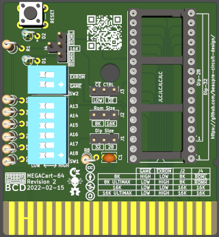
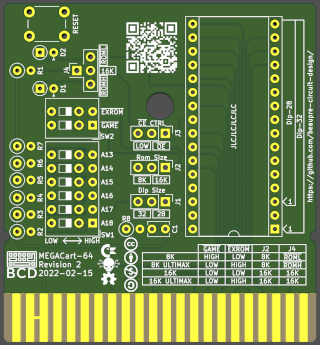
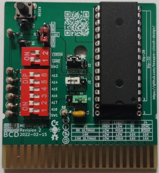
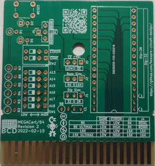

# MegaCart 64

# Introduction

An open-source generic eprom cartridge for the Commodore 64, configurable as an 8K/16K and 8K/16K Ultimax cartridge. The main difference with other design are compatibility with 28 and 32 pin rom chips, allowing newer/current eeprom/flash to be used while keeping compatibilty with older devices.

# Compatibility

The design is comparable to BWACK's Versa64Cart and has the same basic limitations (no software bank switching capabilities) and therefore is not suitable as a Kernal replacement or cartridge that use more than 16K of rom.

# Configuration

## J1 - Device Size

Set J1 accordingly to the device used (28 or 32 pin).

## J2 - Rom Size

Set J2 to the rom image size (8K or 16K).

## J3 - CE CTRL

J3 should always be set to LOW, unless you have very special needs.

## SW2/J4 - Mode Select

Cartridge mode is set by both SW2 and J4, the following table list all the possible modes:

|Mode         |GAME   |EXROM  |ROML   |ROMH   |16K    |C64 Address Space             |
|:-----------:|:-----:|:-----:|:-----:|:-----:|:-----:|:----------------------------:|
|8K           |HIGH   |LOW    |Short  |       |       |0x8000-0x9FFF                 |
|8K Ultimax   |LOW    |HIGH   |       |Short  |       |0xE000-0xFFFF                 |
|16K          |LOW    |LOW    |       |       |Short  |0x8000-0xBFFF                 |
|16K Ultimax  |LOW    |HIGH   |       |       |Short  |0x8000-0x9FFF, 0xE000-0XFFFF  |

In Ultimax cartridge mode, the Kernal ROM (0xE000 – 0xFFFF) is replaced by the content of the EPROM of the MegaCart-64. When the 6510 CPU reset, it jump to the Reset vector located at 0xFFFC and 0xFFFD. the software in the EPROM will completely take control of the computer, allowing cartridge like the C64 Dead Test to work.

In normal cartridge mode, the C64 Kernal check memory location 0x8004-0x8008 for the cartridge signature CBM80 (PETSCII 0xC3, 0xC2, 0xCD, 0x38, 0x30), if found the Kernal will jump to the cartridge cold start vector (0x8000-0x8001).

## SW1 - Bank Switching

Bank switching of the EPROM is done by SW1 accordingly to this table (in 16K mode, A13 is ignored), up to 64 8k banks or 32 16K banks are available using a AT29C040 or similar EEPROM.

|Mode   |A13  |A14  |A15  |A16  |A17  |A18  | Start of Bank   |
|:-----:|:---:|:---:|:---:|:---:|:---:|:---:|:---------------:|
|8/16K  |     |     |     |     |     |     |0x00000          |
|8K     |  X  |     |     |     |     |     |0x02000          |
|8/16K  |     |  X  |     |     |     |     |0x04000          |
|8K     |  X  |  X  |     |     |     |     |0x06000          |
|8/16K  |     |     |  X  |     |     |     |0x08000          |
|8K     |  X  |     |  X  |     |     |     |0x0A000          |
|8/16K  |     |  X  |  X  |     |     |     |0x0C000          |
|8K     |  X  |  X  |  X  |     |     |     |0x0E000          |
...
|8/16K  |     |     |     |  X  |     |     |0x10000          |
...
|8/16K  |     |     |     |     |  X  |     |0x20000          |
...
|8/16K  |     |     |     |  X  |  X  |     |0x30000          |
...
|8/16K  |     |     |     |     |     |  X  |0x40000          |
...
|8/16K  |     |     |     |  X  |     |  X  |0x50000          |
...
|8/16K  |     |     |     |     |  X  |  X  |0x60000          |
...
|8/16K  |     |     |     |  X  |  X  |  X  |0x70000          |
...
|8/16K  |     |     |  X  |  X  |  X  |  X  |0x78000          |
|8K     |  X  |     |  X  |  X  |  X  |  X  |0x7A000          |
|8/16K  |     |  X  |  X  |  X  |  X  |  X  |0x7C000          |
|8K     |  X  |  X  |  X  |  X  |  X  |  X  |0x7E000          |

# Components and assembly

[Gerbers files](Gerbers/) are available for uploading to your prefered manufacturer (I personnally use JLCPCB). In adition to the PCB, a few components must be sourced. If you want to save a few cents or don't want to use Dip-Switch, SW1 can be replace by a 2x6 male header and SW2 with a 2x2 male header. The values of R1-R8 are not critical, anything over 1K will probably work just fine too. As usual, start with the smallest components and build up (in this case, the sockets and capacitors are probably the smallest height you will have).

|Designator|Value                                |Total Quantity|
|----------|-------------------------------------|--------------|
|C1        |Ceramic Capacitor 100nF              |1             |
|R1-R8     |10K Resistor                         |8             |
|D1-D2     |1N4148 Diode                         |2             |
|U1        |32 pin Dip Socket                    |1             |
|SW1       |Dip Switch 6 Positions               |1             |
|SW2       |Dip Switch 2 Positions               |1             |
|J1-J4     |13 pin Male Header (cut as needed)   |1             |
|PB1       |Push button momentary 6mm            |1             |

Once everything is assembled, program your eprom, configure the board and you're done.

# Licence

This work is licensed under the Creative Commons Attribution-NonCommercial-ShareAlike 4.0 International License. To view a copy of this license, visit http://creativecommons.org/licenses/by-nc-sa/4.0/ or send a letter to Creative Commons, PO Box 1866, Mountain View, CA 94042, USA.

# Revision History

|Revision  |Description                    |
|:--------:|-------------------------------|
|1.0       |Initial prototype              |
|2.0       |Reduce size, revised silkscreen|
